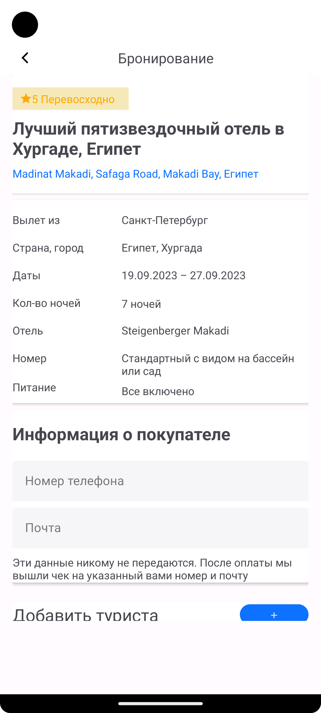
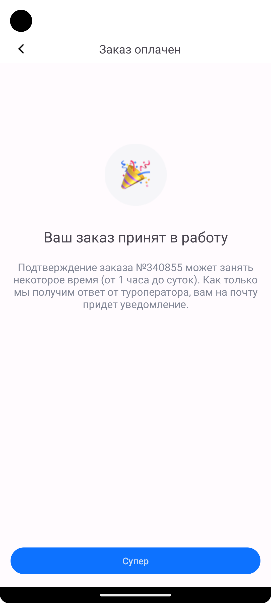

# Приложение для бронирования отелей:
Приложение с помощью которого ты можешь найти и забронировать свой отель.

<p  align="center">
<code></code>
</p>

## Стек используемых технологий

<p  align="left">
<code></code>
<code></code>
<code></code>
<code></code>
<code></code>
</p>

##  Описание работы приложения

После загрузки приложения мы видим экран где есть:
описание отелей.

Для перехода к описанию комнат доступных к бронированию тапаем на ```К выбору комнаты```.

<p  align="center">
<code></code>
</p>

На экране выбора комнат есть цена комнаты за период проживания, название и опции комнаты.

Для бронирования комнаты нужно нажать на ```Выбрать номер```.

<p  align="center">
<code></code>
</p>

На экране бронирования комнаты есть поля: Блок с отелем, Блок с данными брони, Блок с информацией о покупателе, Блок с итоговой ценой.

Если мы хотим оформить заказ, то тапаем по кнопке ```Оплатить```.

<p  align="center">
<code></code>
</p>

После удачного оформления появляется экран с информацией о заказе.

<p  align="center">
<code></code>
</p>

## Описание проекта

В проекте использовал:

1. Языки Kotlin + XML.
2. Архитектура Clean Architecture + MVVM.
3. Многомодульность - отдельно по слоям Data, Domain, Presentation (По фичам заняло бы больше времени).
4. Навигация с помощью Jetpack's Navigation Component.
5. Инъекция зависимости с помощью Hilt.
6. Получение данных из Api c помощью Retrofit.
7. Получение данных из ViewModels через StateFlow.